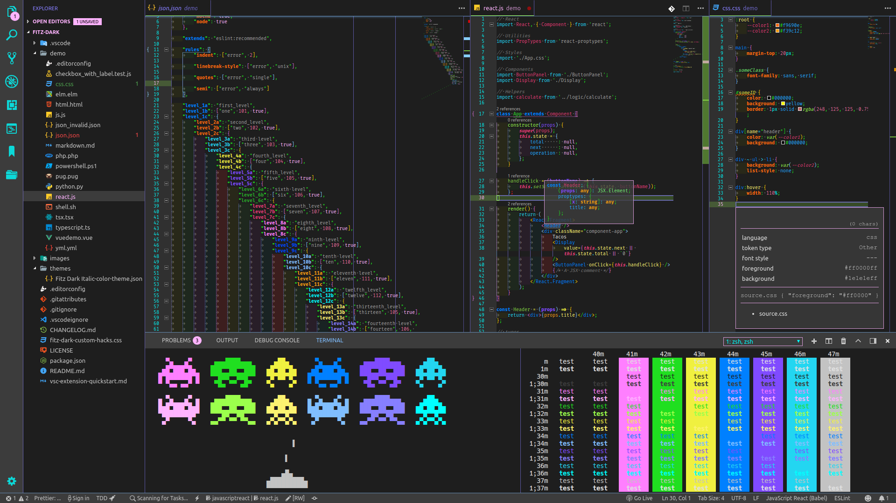

# Fitz Dark Markdown Preview for VS Code

<!--ts-->
   * [Fitz Dark Markdown Preview for VS Code](#fitz-dark-markdown-preview-for-vs-code)
      * [Setup](#setup)
      * [Theme Details](#theme-details)
         * [Highlights](#highlights)
         * [Colors](#colors)
            * [Grayscale](#grayscale)
            * [Chromatic](#chromatic)
            * [Validation](#validation)
            * [Opacity Levels](#opacity-levels)
      * [Getting Started](#getting-started)
         * [Installation](#installation)
      * [Contributing](#contributing)
      * [Versioning](#versioning)
      * [Authors](#authors)
      * [License](#license)
      * [Acknowledgments](#acknowledgments)
      * [Notes](#notes)
      * [Todo](#todo)
      * [FAQ](#faq)

<!-- Added by: shea, at: 2018-08-03T19:42-05:00 -->

<!--te-->

## Setup

(for screen shot above)

- [Fitz Dark Italic Theme](https://github.com/sheafitzek/fitz-dark-vscode-markdown-preview)
- [Material Icon Theme](https://marketplace.visualstudio.com/items?itemName=PKief.material-icon-theme)
- [Sublime Babel](https://marketplace.visualstudio.com/items?itemName=joshpeng.sublime-babel-vscode) **!important**: adds extra token definitions that are colored by the theme
- [Rainbow Brackets](https://marketplace.visualstudio.com/items?itemName=2gua.rainbow-brackets)
- [indent-rainbow](https://marketplace.visualstudio.com/items?itemName=oderwat.indent-rainbow)
- [Fura Code Nerd Font](https://github.com/ryanoasis/nerd-fonts/tree/master/patched-fonts/FiraCode) in editor (Also looks great with [Operator Mono](https://www.typography.com/fonts/operator/styles/))
- [Hack Nerd Font](https://github.com/ryanoasis/nerd-fonts/tree/master/patched-fonts/Hack) in Terminal

## Theme Details

### Highlights

- 30 different color shades used
- Distinct colors for JSON levels (to 16 levels deep)
- [add-on CSS file](./fitz-dark-italic-custom.css) for:
	- Dirty (unsaved) tab red dot
	- Active tab top border
	- Minimap vertical borders

### Colors

#### Grayscale

-  **#1e1e1e**
	- ***UI***
		- *main background*
		- *active tab background*
		- *terminal background*
		- *terminal black (00)*
	- ***Syntax***
		- **Global**
			- *N/A*

-  **#3c3c3c**
	- ***UI***
		- *secondary background*
		- *inactive indent guides*
		- *terminal bright black (08)*
	- ***Syntax***
		- **Global**
			- *N/A*

-  **#555555**
	- ***UI***
		- *hover background*
		- *drop background*
	- ***Syntax***
		- **Global**
			- *N/A*

-  **#777777**
	- ***UI***
		- *editor whitespace*
		- *git decoration - ignored*
	- ***Syntax***
		- **Global**
			- *comments*

-  **#c3c3c3**
	- ***UI***
		- *selection background*
		- *terminal white (07)*
	- ***Syntax***
		- **Global**
			- *strings*
		- **Markdown**
			- *quotes*

-  **#e1e1e1**
	- ***UI***
		- *editor foreground*
		- *editor selection background*
		- *terminal foreground*
		- *terminal bright white (15)*
	- ***Syntax***
		- **Global**
			- *text*
		- **INI**
			- *source*
		- **Markdown**
			- *paragraph*
		- **Shell**
			- *logical expression*

#### Chromatic

-  **#f9690e**
	- ***UI***
		- *git merge common*
		- *git decoration - modified*
	- ***Syntax***
		- **Global**
			- *property name support types*
		- **JSON**
			- *level 2 keys*
		- **Powershell**
			- *script blocks*

-  **#f39c12**
	- ***UI***
		- *N/A*
	- ***Syntax***
		- **Global**
			- *support types*
			- *other variables*
		- **JSON**
			- *level 11 keys*
		- **Python**
			- *item access*

-  **#f0f040**
	- ***UI***
		- *terminal yellow (06)*
		- *git decoration - un-tracked*
	- ***Syntax***
		- **Global**
			- *section name entities*
			- *arithmetic operator keywords*
			- *assignment operator keywords*
			- *logical operator keywords*
			- *arrow function storage type*
			- *variable punctuation variable*
		- **CSS**
			- *id attribute name entities*
		- **JSON**
			- *level 4 keys*
		- **Markdown**
			- *level 3 headings*

-  **#fcf270**
	- ***UI***
		- *input foreground*
		- *terminal bright yellow (14)*
	- ***Syntax***
		- **Global**
			- *attribute name entities*
		- **JS**
			- *object properties*
		- **JSON**
			- *level 13 keys*
		- **TS**
			- *object properties*
		- **Markdown**
			- *level 6 headings*

-  **#28a228**
	- ***UI***
		- *git merge current*
	- ***Syntax***
		- **Global**
			- *class name entities*
			- *inherited class entities*
			- *support classes*
			- *class variables*
		- **JS**
			- *class constructor function*
		- **JSON**
			- *level 6 keys*

-  **#76ff76**
	- ***UI***
		- *N/A*
	- ***Syntax***
		- **Global**
			- *type name entities*
		- **CSS**
			- *class attribute name entities*

-  **#20df20**
	- ***UI***
		- *terminal green (02)*
	- ***Syntax***
		- **Global**
			- *braces*
			- *punctuation*
		- **Markdown**
			- *quote definition punctuation*
			- *list definition punctuation*
			- *separator*

-  **#9cff4c**
	- ***UI***
		- *active tab borders*
		- *cursor*
		- *line highlight*
		- *terminal bright green (10)*
	- ***Syntax***
		- **Global**
			- *function / method name entities*
			- *support functions*
		- **JSON**
			- *level 15 keys*

-  **#0047ff**
	- ***UI***
		- *git merge incoming*
	- ***Syntax***
		- **Global**
			- *new operator keyword*
		- **JSON**
			- *level 9 keys*

-  **#22a7ff**
	- ***UI***
		- *N/A*
	- ***Syntax***
		- **Global**
			- *other constants*
			- *markup fenced code block language*
			- *markup raw*
			- *markup raw inline*
			- *support constants*
		- **CSS**
			- *property values*
		- **JS**
			- *object properties*
		- **JSON**
			- *level 16 keys*
		- **Markdown**
			- *fenced code block embedded block*
			- *link titles*
		- **TS**
			- *object properties*

-  **#0080ff**
	- ***UI***
		- *terminal blue (01)*
	- ***Syntax***
		- **Global**
			- *tag name entities*
			- *storage modifiers*
			- *storage types*
		- **CSS**
			- *tag name entities*
		- **HTML**
			- *embedded attribute name entities*
		- **JSON**
			- *level 1 keys*

-  **#80beff**
	- ***UI***
		- *widget shadows*
		- *button backgrounds*
		- *horizontal borders*
		- *terminal bright blue (09)*
	- ***Syntax***
		- **Global**
			- *character constants*
		- **JSON**
			- *level 10 keys*
		- **Markdown**
			- *level 5 headings*

-  **#23d6f1**
	- ***UI***
		- *terminal cyan (03)*
		- *git decoration - submodule*
	- ***Syntax***
		- **Global**
			- *control keywords*
			- *operator keywords*
			- *markup underlined link*
		- **JSON**
			- *level 3 keys*
		- **Markdown**
			- *link reference*

-  **#00ffff**
	- ***UI***
		- *activity bar icons*
		- *line numbers*
		- *terminal bright cyan (11)*
	- ***Syntax***
		- **Global**
			- *other keywords*
		- **JSON**
			- *level 12 keys*
		- **Markdown**
			- *level 2 headings*
		- **PHP**
			- *variable definition punctuation*

-  **#804bff**
	- ***UI***
		- *terminal magenta (05)*
		- *git decoration - conflicting*
	- ***Syntax***
		- **Global**
			- *parameter variables*
		- **JS**
			- *function arguments*
		- **JSON**
			- *level 5 keys*
		- **Python**
			- *function arguments*

-  **#877fff**
	- ***UI***
		- *vertical borders*
		- *editor rulers*
		- *extension buttons*
		- *terminal bright magenta (13)*
	- ***Syntax***
		- **Global**
			- *fenced code blocks*
		- **JSON**
			- *level 14 keys*

-  **#e13b74**
	- ***UI***
		- *N/A*
	- ***Syntax***
		- **Global**
			- *language variables*
			- *read-write variables*
		- **JSON**
			- *level 7 keys*
		- **Python**
			- *item access arguments*
		- **Shell**
			- *scope group*

-  **#e26a9b**
	- ***UI***
		- *N/A*
	- ***Syntax***
		- **Global**
			- *numeric constants*

-  **#ff7fff**
	- ***UI***
		- *terminal red (04)*
		- *git decoration - deleted*
	- ***Syntax***
		- **Global**
			- *logical operator keywords*
		- **JSON**
			- *level 8 keys*
		- **Markdown**
			- *level 1 headings*

-  **#ffb3ff**
	- ***UI***
		- *badges*
		- *active line number*
		- *active indent guide*
		- *widget borders*
		- *terminal bright red (12)*
		- *terminal selection background*
		- *terminal cursor*
	- ***Syntax***
		- **Global**
			- *language constants*
		- **Markdown**
			- *level 4 headings*

#### Validation

-  **#00ff00**
	- ***UI***
		- *info*
	- ***Syntax***
		- **Global**
			- *info tokens*

-  **#ffa500**
	- ***UI***
		- *warnings*
	- ***Syntax***
		- **Global**
			- *warning tokens*

-  **#ff0000**
	- ***UI***
		- *errors*
	- ***Syntax***
		- **Global**
			- *invalid*
			- *error tokens*

-  **#ffff00**
	- ***UI***
		- *debug*
	- ***Syntax***
		- **Global**
			- *debug tokens*

#### Opacity Levels

00 11 22 <mark>***33***</mark> 44 55 <mark>***66***</mark> 77 88 <mark>***99***</mark> aa bb <mark>***cc***</mark> dd ee ff

## Getting Started

### Installation

1. Install & launch [Visual Studio Code](https://code.visualstudio.com/)
1. Choose *"Extensions"* from menu
1. Search for `vscode-theme-fitz-dark-italic`
1. Click *"Install"* to install it
1. Click *"Reload"* to reload Visual Studio Code
1. Navigate to *"File"* > *"Preferences"* > *"Color Theme"* > ***"Fitz Dark Italic"***

## Contributing

Please read [CONTRIBUTING.md](./.docs/CONTRIBUTING.md) for the process of filing an issue or submitting a pull request.
For details on our code of conduct, read [CODE_OF_CONDUCT.md](./.docs/CODE_OF_CONDUCT.md).

## Versioning

We use [SemVer](http://semver.org/) for versioning. For the versions available, see the [tags on this repository](https://github.com/sheafitzek/fitz-dark-vscode-markdown-preview/tags).

## Authors

- **Shea Fitzek** - *Initial work* - [sheafitzek](https://github.com/sheafitzek)

See also the list of [contributors](./.docs/CONTRIBUTORS.md) who participated in this project.

## License

This project is licensed under the MIT License - see the [LICENSE.md](./LICENSE) file for details

## Acknowledgments

I took a lot of inspiration and borrowed from the [Cobalt2](https://marketplace.visualstudio.com/items?itemName=wesbos.theme-cobalt2) & [Night Owl](https://marketplace.visualstudio.com/items?itemName=sdras.night-owl) themes. Also Sarah Drasner's post [Creating a VS Code Theme](https://css-tricks.com/creating-a-vs-code-theme/) on [CSS Tricks](https://css-tricks.com/) helped a ton to just get up and going.

## Notes

- This palette was selected not because I think these are all the best colors in an aesthetic sense, but because I wanted as many colors as possible for tokens while still being able to tell them apart if they are side by side or on top of one another. I'm sure there are some better colors that could be plugged in while still achieving the contrast I'm looking for, so feel free to send a pull request. You can play with the palette over on colourco.de. You will have to copy & paste this url into your browser to get it to pull up:

`https://colourco.de/none/%23f9690e%2C%23f39c12%2C%23f0f040%2C%23fcf270%2C%2328a228%2C%2376ff76%2C%2320df20%2C%239cff4c%2C%230047ff%2C%2322a7ff%2C%230080ff%2C%2380beff%2C%2323d6f1%2C%2300ffff%2C%23804bff%2C%23877fff%2C%23e13b74%2C%23e26a9b%2C%23ff7fff%2C%23ffb3ff/`

- All braces / brackets have been left the same color as punctuation because I use the [Rainbow Brackets](https://marketplace.visualstudio.com/items?itemName=2gua.rainbow-brackets) extension (link above) to color them.
- There is a `demo` folder in the repo with sample files for many different languages for testing purposes, but I mainly just use HTML, CSS, JavaScript, JSON, React & Markdown, so I'm sure some of the coverage is missing in the other languages. If you see any red tokens that aren't invalid, open up the *command palette* (<kbd>Ctrl + Shift + P</kbd>) and use the `Developer: Inspect TM Scopes` command to check them out. If the color comes up as `#ff1111`, then there is missing coverage. File an issue and please make sure to indicate whether or not you have the [Sublime Babel](https://marketplace.visualstudio.com/items?itemName=joshpeng.sublime-babel-vscode) extension installed. Then paste a snippet of the code at the end of the corresponding language file in the `demo` folder and make a pull request. 
- To use the [add-on CSS file](./fitz-dark-italic-custom.css), see [Custom CSS and JS Loader](https://marketplace.visualstudio.com/items?itemName=be5invis.vscode-custom-css).

## Todo

- [ ] figure out how to change whitespace tab character

## FAQ

None yet...
