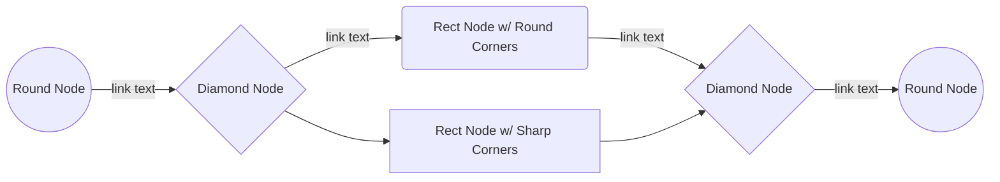
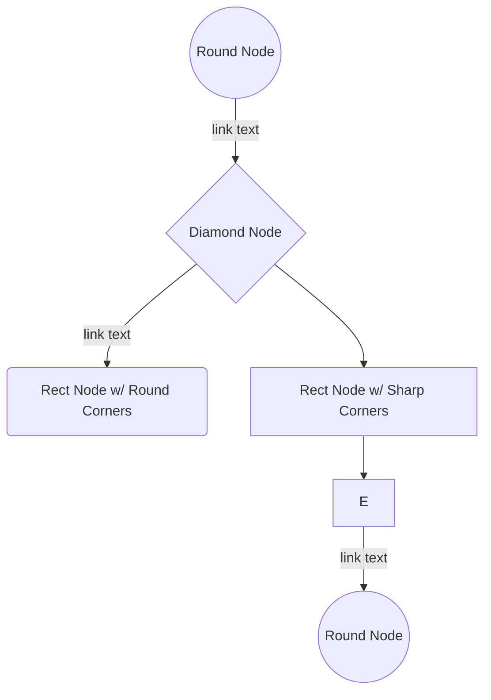

# markdown-syntax.md

[TOC]

## CommonMark

### Headers

Syntax:

```markdown
# h1 Header
## h2 Header
### h3 Header
#### h4 Header
##### h5 Header
###### h6 Header
```


```html
<h1>h1 Header</h1>
<h2>h2 Header</h2>
<h3>h3 Header</h3>
<h4>h4 Header</h4>
<h5>h5 Header</h5>
<h6>h6 Header</h6>
```

Renders:

<!-- markdownlint-disable MD025 -->

# h1 Header

<!-- markdownlint-enable MD025 -->

## h2 Header

### h3 Header

#### h4 Header

##### h5 Header

###### h6 Header

### Text

#### Paragraph

Syntax:

```markdown
Lorem ipsum dolor sit amet, graecis denique ei vel, at duo primis mandamus. Et legere ocurreret pri, animal tacimates complectitur ad cum. Cu eum inermis inimicus efficiendi. Labore officiis his ex, soluta officiis concludaturque ei qui, vide sensibus vim ad.
```

Compiles to:

```html
<p>Lorem ipsum dolor sit amet, graecis denique ei vel, at duo primis mandamus. Et legere ocurreret pri, animal tacimates complectitur ad cum. Cu eum inermis inimicus efficiendi. Labore officiis his ex, soluta officiis concludaturque ei qui, vide sensibus vim ad.</p>
```

Renders:

Lorem ipsum dolor sit amet, graecis denique ei vel, at duo primis mandamus. Et legere ocurreret pri, animal tacimates complectitur ad cum. Cu eum inermis inimicus efficiendi. Labore officiis his ex, soluta officiis concludaturque ei qui, vide sensibus vim ad.

#### Formatting

##### Bold & Italic

Syntax:

```markdown
**Bold**
*Italic*
***Bold & Italic***
```

Compiles to:

```html
<strong>Bold</strong>
<em>Italic</em>
<strong><em>Bold & Italic</em></strong>
```

Renders:

**Bold**
*Italic*
***Bold & Italic***

#### Block Quotes

Syntax:

```markdown
> "Lorem ipsum dolor sit amet, graecis denique ei vel, at duo primis mandamus.
> Et legere ocurreret pri, animal tacimates complectitur ad cum.
> Cu eum inermis inimicus efficiendi.
> Labore officiis his ex, soluta officiis concludaturque ei qui, vide sensibus vim ad."
```

Compiles to:

```html
<blockquote>
  <p>
    "Lorem ipsum dolor sit amet, graecis denique ei vel, at duo primis mandamus.
    <br>
    Et legere ocurreret pri, animal tacimates complectitur ad cum.
    <br>
    Cu eum inermis inimicus efficiendi.
    <br>
    Labore officiis his ex, soluta officiis concludaturque ei qui, vide sensibus vim ad."
  </p>
</blockquote>
```

Renders:

> "Lorem ipsum dolor sit amet, graecis denique ei vel, at duo primis mandamus.
> Et legere ocurreret pri, animal tacimates complectitur ad cum.
> Cu eum inermis inimicus efficiendi.
> Labore officiis his ex, soluta officiis concludaturque ei qui, vide sensibus vim ad."

### LISTS

#### Unordered

Syntax:

```markdown
- this
  - is
    - a
- list
  - of
  - mixed
- symbols
```

Compiles to:

```html
<ul>
  <li>
    this
    <ul>
      <li>
        is
        <ul>
          <li>a</li>
        </ul>
      </li>
    </ul>
  <li>
    list
    <ul>
      <li>of</li>
      <li>mixed</li>
    </ul>
  </li>
  <li>symbols</li>
</ul>
```

Renders:

- this
  - is
    - a
- list
  - of
  - mixed
- symbols

#### Ordered

Syntax:

```markdown
1. this
  1. is
    1. an
1. ordered
1. list
```

Compiles to:

```html
<ol start="1">
  <li>
    this
    <ol start="1">
      <li>is</li>
      <ol>
        <li>an</li>
      </ol>
    </ol>
  </li>
  <li>ordered</li>
  <li>list</li>
</ol>
```

Renders:

1. this
   1. is
      1. an
1. ordered
1. list

#### Mixed

Syntax:

```markdown
5. this
  1. list
    - is
  - a
- mix
- of
  - ordered
    1. and
- unordered
```

Compiles to:

```html
<ol start="5">
  <li>
    this
    <ol start="1">
      <li>
        list
        <ul>
          <li>is</li>
        </ul>
      </li>
      <ul>
        <li>a</li>
      </ul>
    </ol>
  </li>
</ol>

<ul>
  <li>mix</li>
  <li>
    of
    <ul>
      <li>
        ordered
        <ol start="1">
          <li>
            and
          </li>
        </ol>
      </li>
    </ul>
  </li>
  <li>unordered</li>
</ul>
```

Renders:

5. this
   1. list
      - is
   - a
- mix
- of
  - ordered
      1. and
- unordered

### Code

#### Block

##### Syntax Highlighted

Syntax:

~~~markdown
```javascript
const addOne = function(num) {
  return num + 1;
}

addOne(24);

// 25
```
~~~

Compiles to:

```html
<pre>
  <code class="language-javascript">
    const addOne = function(num) {
      return num + 1;
    }

    addOne(24);

    // 25
  </code>
</pre>
```

Renders:

```javascript
const addOne = function(num) {
  return num + 1;
}

addOne(24);

// 25
```

##### Not Highlighted

Syntax:

~~~markdown
```
const addOne = function(num) {
  return num + 1;
}

addOne(24);

// 25
```
~~~

Compiles to:

```html
<pre>
  <code>
    const addOne = function(num) {
      return num + 1;
    }

    addOne(24);

    // 25
  </code>
</pre>
```

Renders:

<!-- markdownlint-disable MD040 -->

```
const addOne = function(num) {
  return num + 1;
}

// 25
```

<!-- markdownlint-enable MD040 -->

#### Inline

Syntax:

```shell
`sed 's/x/y/g'`
```

Compiles to:

```html
<code>sed 's/x/y/g'</code>
```

Renders:

`sed 's/x/y/g'`

### Links

#### Inline

Syntax:

```markdown
[CommonMark](https://commonmark.org/)
```

Compiles to:

```html
<a href="https://commonmark.org/" title="https://commonmark.org/">
  CommonMark
</a>
```

Renders:

[CommonMark](https://commonmark.org/)

#### Relative

Syntax:

```markdown
[CONTRIBUTING](docs/CONTRIBUTING.md)
```

Compiles to:

```html
<a href="docs/CONTRIBUTING.md">
  CONTRIBUTING
</a>
```

Renders:

[CONTRIBUTING](docs/CONTRIBUTING.md)

#### Reference

Syntax:

```markdown
[CommonMark][1]

[1]: https://commonmark.org/
```

Compiles to:

```html
<a href="https://commonmark.org/" title="https://commonmark.org/">CommonMark</a>
```

Renders:

[CommonMark][1]

[1]: https://commonmark.org/

### Images

#### Inline

Syntax:

```markdown

```

Compiles to:

```html

```

Renders:


#### Reference

```markdown
![Stormtroopocat][2]

[2]: https://octodex.github.com/images/stormtroopocat.jpg "Stormtroopocat"
```

Compiles to:

```html

```


Renders:

![Stormtroopocat][2]

[2]: https://octodex.github.com/images/stormtroopocat.jpg "Stormtroopocat"

### HORIZONTAL RULE

Syntax:

```markdown
---
```

Compiles to:

```html
<hr>
```

Renders:

- - -

## GITHUB

### Formatting

#### Strikethrough

Syntax:

```markdown
~~Strikethrough~~
```

Compiles to:

```html
<del>Strikethrough</del>
```

Renders:

~~Strikethrough~~

### Task List

Syntax:

```markdown
- [x] Finish my changes
- [ ] Push my commits to GitHub
- [ ] Open a pull request
```

Compiles to:

```html
<ul class="contains-task-list">
  <li class="task-list-item"><input type="checkbox" id="" disabled="" class="task-list-item-checkbox" checked=""> Finish my changes</li>
  <li class="task-list-item"><input type="checkbox" id="" disabled="" class="task-list-item-checkbox"> Push my commits to GitHub</li>
  <li class="task-list-item"><input type="checkbox" id="" disabled="" class="task-list-item-checkbox"> Open a pull request</li>
</ul>
```

Renders:

<ul class="contains-task-list">
  <li class="task-list-item"><input type="checkbox" id="" disabled="" class="task-list-item-checkbox" checked=""> Finish my changes</li>
  <li class="task-list-item"><input type="checkbox" id="" disabled="" class="task-list-item-checkbox"> Push my commits to GitHub</li>
  <li class="task-list-item"><input type="checkbox" id="" disabled="" class="task-list-item-checkbox"> Open a pull request</li>
</ul>

### Username @mentions

Syntax:

```markdown
@mojombo
```

Compiles to:

```html
<p>
  <a class="user-mention" data-hovercard-user-id="1" data-octo-click="hovercard-link-click" data-octo-dimensions="link_type:self" href="https://github.com/mojombo" aria-describedby="hovercard-aria-description">
    @mojombo
  </a>
</p>
```

Renders:

<p>
  <a class="user-mention" data-hovercard-user-id="1" data-octo-click="hovercard-link-click" data-octo-dimensions="link_type:self" href="https://github.com/mojombo" aria-describedby="hovercard-aria-description">
    @mojombo
  </a>
</p>

### Raw Links

Syntax:

```markdown
Visit https://github.com
```

Compiles to:

```html
<p>
  Visit 
  <a href="https://github.com">
    https://github.com
  </a>
</p>
```

Renders:

Visit [https://github.com](https://github.com)

### Issue & Pull Request References

Syntax:

```markdown
mojombo/github-flavored-markdown#1
```

Combines to:

```html
<a class="commit-link" href="https://github.com/mojombo/github-flavored-markdown/commit/16c999e8c71134401a78d4d46435517b2271d6ac">mojombo/github-flavored-markdown@<tt>16c999e</tt></a>
```

Renders:

[mojombo/github-flavored-markdown#1](https://github.com/mojombo/github-flavored-markdown/commit/16c999e8c71134401a78d4d46435517b2271d6ac)

### SHA References

Syntax:

```markdown
mojombo/github-flavored-markdown@16c999e8c71134401a78d4d46435517b2271d6ac
```

Compiles to:

```html
<a class="commit-link" href="https://github.com/mojombo/github-flavored-markdown/commit/16c999e8c71134401a78d4d46435517b2271d6ac">
  mojombo/github-flavored-markdown@
  <tt>16c999e</tt>
</a>
```

Renders:

[mojombo/github-flavored-markdown@16c999e](https://github.com/mojombo/github-flavored-markdown/commit/16c999e8c71134401a78d4d46435517b2271d6ac)

### Emoji

Syntax:

```markdown
:+1: :100:
```

Compiles to:

```html
<p>
  <g-emoji class="g-emoji" alias="+1" fallback-src="https://assets-cdn.github.com/images/icons/emoji/unicode/1f44d.png">
    
  </g-emoji>
     
  <g-emoji class="g-emoji" alias="100" fallback-src="https://assets-cdn.github.com/images/icons/emoji/unicode/1f4af.png">
    
  </g-emoji>
</p>
```

Renders:

:+1: :100:

### Tables

Syntax:

```markdown
| first column title | second column title | third column title |
| :----------------- | :-----------------: | -----------------: |
| left aligned       | center aligned      | right aligned      |
| content            | content             | content            |
```

Compiles to:

```html
<table>
  <thead>
    <tr>
      <th style="text-align:left">first column title</th>
      <th style="text-align:center">second column title</th>
      <th style="text-align:right">third column title</th>
    </tr>
  </thead>
  <tbody>
    <tr>
      <td style="text-align:left">left aligned</td>
      <td style="text-align:center">center aligned</td>
      <td style="text-align:right">right aligned</td>
    </tr>
    <tr>
      <td style="text-align:left">content</td>
      <td style="text-align:center">content</td>
      <td style="text-align:right">content</td>
    </tr>
  </tbody>
</table>
```

Renders:

| first column title | second column title | third column title |
| :----------------- | :-----------------: | -----------------: |
| left aligned       | center aligned      | right aligned      |
| content            | content             | content            |
| left aligned       | center aligned      | right aligned      |
| content            | content             | content            |
| left aligned       | center aligned      | right aligned      |
| content            | content             | content            |

### Table of Contents

Syntax:

```markdown
[Header 1](#header-1)
[Header 2](#header-2)

# Header 1

## Header 2
```

Compiles to:

```html
<ul>
  <a href="#header-1">Header 1</a>
  <ul>
    <li>
      <a href="#header-2">Header 2</a>
    </li>
  </ul>
</ul>

<h1>Header 1</h1>

<h2>Header 2</h2>
```

Renders:


<ul>
  <a href="#header-1">Header 1</a>
  <ul>
    <li>
      <a href="#header-2">Header 2</a>
    </li>
  </ul>
</ul>

## Markdown-it Extensions

### Underline

Syntax:

```markdown
_Underline_
```

Compiles to:

```html
<del>Underline</del>
```

Renders:

~~Underline~~

### Enhanced Github References

#### SHA References

16c999e8c71134401a78d4d46435517b2271d6ac
mojombo@16c999e8c71134401a78d4d46435517b2271d6ac

#### Issue References Within a Repository

\#1
mojombo#1

### Tables

Syntax:

```markdown
| first column title | second column title | third column title |
| :----------------- | :-----------------: | -----------------: |
| left aligned       | center aligned      | right aligned      |
| content            | content             | content            |
```

Compiles to:

```html
<table>
  <thead>
    <tr>
      <th style="text-align:left">first column title</th>
      <th style="text-align:center">second column title</th>
      <th style="text-align:right">third column title</th>
    </tr>
  </thead>
  <tbody>
    <tr>
      <td style="text-align:left">left aligned</td>
      <td style="text-align:center">center aligned</td>
      <td style="text-align:right">right aligned</td>
    </tr>
    <tr>
      <td style="text-align:left">content</td>
      <td style="text-align:center">content</td>
      <td style="text-align:right">content</td>
    </tr>
  </tbody>
</table>
```

Renders:

| first column title | second column title | third column title |
| :----------------- | :-----------------: | -----------------: |
| left aligned       | center aligned      | right aligned      |
| content            | content             | content            |
| left aligned       | center aligned      | right aligned      |
| content            | content             | content            |
| left aligned       | center aligned      | right aligned      |
| content            | content             | content            |

### Audio / Video Links


### Admonition

!!! note
    note with title
!!! summary summary, abstract, tldr
!!! info info, todo
!!! tip tip, hint
!!! success success, check, done
!!! question question, help, faq
!!! warning warning, attention, caution
!!! failure failure, fail, missing
!!! danger danger, error, bug
!!! example example, snippet
!!! quote quote, cite
    !!! note ""
        nested note, no title

### Enhanced Anchor Link

Go to
[Headers](#Headers)
[Lists](#Lists)

### Abbr

*[HTML]: Hyper Text Markup Language
*[W3C]:  World Wide Web Consortium

The HTML specification is maintained by the W3C.

### Deflist

Apple
:   Pomaceous fruit of plants of the genus Malus in the family Rosaceae.

### Sup / Sub

29^th^, H~2~O

### Checkbox

[ ] unchecked
[x] checked

### Attrs

item **bold red**{style="color:red"}

### Kbd

[[Ctrl+Esc]]

### Underline

_underline_

### Container

::::: container
:::: row
::: col-xs-6 alert alert-success
success text
:::
::: col-xs-6 alert alert-warning
warning text
:::
::::
:::::

### Flow Charts (Mermaid)


#### left to right



#### top down



### Emoji

Emoji! :sparkles: :camel: :boom:

### Text

#### Formatting

##### other

++Underline++
or
_Underline_

~~Strikethrough~~
or
<s>Strikethrough</s>

==Highlight==
or
<mark>Highlight</mark>

Super^script^
or
Super<sup>script</sup>

Sub~script~
or
Sub<sub>script</sub>

### Task List / Todo

- [x] this
  - [ ] is
- [x] a
  - [x] task
- [ ] list

### Math

#### Block

$$
J_\alpha(x) = \sum\limits_{m=0}^\infty \frac{(-1)^m}{m! \, \Gamma(m + \alpha + 1)}{\left({\frac{x}{2}}\right)}^{2 m + \alpha}
$$

#### Inline

$\sqrt{3x-1}+(1+x)^2$

### Footnotes

This is some text with a footnote.[^1]
This is some other text.
[^1]: And this is the footnote.

## HTML Tags

### Meters

<label for="fuel">Fuel level (high value is good)</label>
<meter id="fuel" name="fuel" min="0" max="100"
low="33" high="66" optimum="80" value="50">
at 50/100
</meter>

<div>
  <label for="pressure">Pressure (low value is good)</label>
  <meter id="pressure" name="pressure" min="0" max="100"
  low="25" high="75" optimum="20" value="50">
  is OK
  </meter>
</div>

### Progress Bars

<label for="file">File progress</label>
<progress id="file" name="file" max="100" value="70">
70%
</progress>

<div>
  <label for="total">Total progress</label>
  <progress id="total" name="total" max="14" value="2">
    2 of 14
  </progress>
</div>

### Detail Summary

<details>
  <summary>this is</summary>

```js
  function foo() {
    console.log(`bar`);
  }
```

</details>

<details>
   <summary>a detail /</summary>

```js
    function foo() {
      console.log(`bar`);
    }
```

</details>

<details>
   <summary>summary list</summary>

```js
    function foo() {
      console.log(`bar`);
    }
```

</details>

### Comments

<comment>

### Quotes

<q>Quoted text.</q>

### CLI output

<samp>
  System will download and install 33 packages.<br>
  Continue with installation? (Y/n) <kbd>y</kbd> <kbd>Enter</kbd><br>
  Press F1 to continue <kbd>F1</kbd><br>
</samp>

- - -

#### Programs

**ssh** or **spacefm**

#### Keyboard Input

<kbd>Alt</kbd>+<kbd>F1</kbd> or <kbd>Enter</kbd>

#### Mouse Input

*"File"* > *"Preferences"* or *"Edit"* > *"Undo"*

#### Keywords or Terms

***identity\_file*** or ***meta\_key***

#### Block Syntax

##### Fenced Code Block

```sh
keyboard input: [Enter] or [Esc]
syntax guide for user input: </path/to/file> or <username>

example:
user@host~$ ssh -i </path/to/key_file> <username>@<remote_host> [Enter]
```
